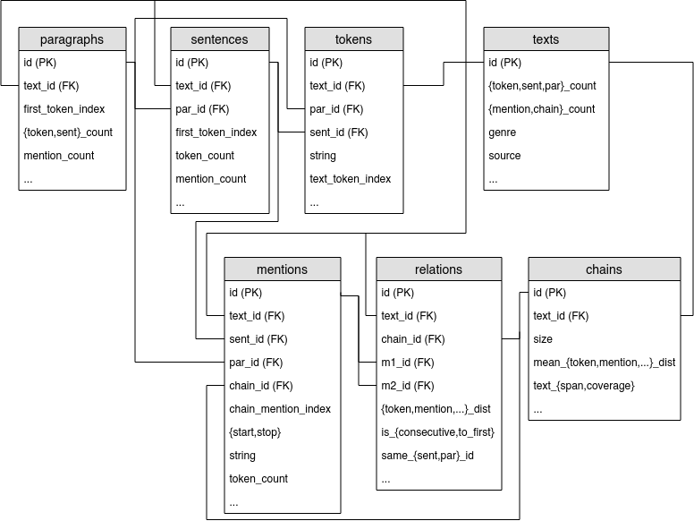

# French and English Coreference Databases and Corpora

This repository contains French and English coreference databases and corpora in various formats, and the scripts to make them.

In this presentation document, you will find:

- an <a href="#introduction">introduction</a>,
- a list of <a href="#corpora">corpora</a> (CoNLL, Democrat, Ancor) and how I have added annotation layers to the <a href="#added-democrat">Democrat</a> corpus (the same annotation layers have been added to Ancor),
- the representation of the corpora and all their linguistic annotations as a <a href="#databases">relational databases</a>, with a <a href="#fields">complete list of all the fields for each table</a>, and the <a href="#values">possible values</a>,
- the <a href="#formats">other formats</a> (conll, jsonlines) the corpora are available in,
- the <a href="#availability">availability</a> of the corpora and their licenses with all the legal stuff from the original corpora,
- instructions on <a href="#compile">how to compile the database</a> (for CoNLL, Democrat, Ancor or <a href="#own-texts">for you own text or corpus</a>).
- the <a href="#license">license for the scripts</a>, and how to cite the modified corpora if you use them.


## Introduction <a name="introduction"/>


**Coreference** is the relation between two expressions of a text that refer to the same world entity.  When there are several such expressions, they form a **coreference chain**.  For example, all the expressions in bold in the following text refer to the same entity _Sophia Loren_:

> **[Sophia Loren]** says **[she]** will always be grateful to Bono.  **The actress** revealed that the U2 singer helped **[her]** calm down when **[she]** became scared by a thunderstorm while travelling on a plane. (This example is from Mitkov's _Anaphora Resolution_ (2002).)

Notice that there is a second chain for the entity _Bono_.

Each expression that is part of a coreference chain is called a **mention**.


## Corpora <a name="corpora"/>

### Available corpora

They are several corpora with coreference annotation in English as well as in French.  The most known corpus in English is the [CoNLL-2012 corpus](http://conll.cemantix.org/2012/data.html) (1.6m tokens, from the [OntoNotes corpus](https://catalog.ldc.upenn.edu/LDC2013T19)), which was used to evaluate systems presented in the CoNLL-2012 shared task (a competition in which several automatic coreference resolution systems competed).  This corpus, based on the OntoNotes corpus, offer several annotation layers, with parts of speech, lemmas, segmentation into phrases and clauses (constitency syntactic parses), named entities, argument structures, reference to WordNet, alongside coreference.

In French, the [Ancor corpus](http://www.info.univ-tours.fr/~antoine/parole_publique/ANCOR_Centre/index.html) (460k tokens) is a corpus of transcribed oral French, with some part of speech and named entity annotation.  Because it is based on conversations and interviews, it contains specific features of oral language, such as disfluencies (word repetitions, interjections as _euh_ "er") and no punctation nor sentence boundaries.

The [Democrat corpus](https://www.ortolang.fr/market/corpora/democrat/) (689k tokens for the whole corpus, 285k for modern texts), on the other hand, is a multi-genre corpus of written texts, from the 12th to the 21st century.  But, besides coreference, it has no valid linguistic annotation whatsoever.  In this repository I offer an enriched version the Democrat corpus, in various formats (including a relational database, as well as CoNLL, jsonlines and text formats), used in the following paper:

> [Wilkens Rodrigo, Oberle Bruno, Landragin Frédéric, Todirascu Amalia (2020). **French coreference for spoken and written language**, _Proceedings of the 12th Edition of the Language Resources and Evaluation Conference (LREC 2020)_, Marseille, France](https://lrec2020.lrec-conf.org/en/).

to train both ODACR and [COFR](https://github.com/boberle/cofr) and described in the LREC paper.  Note that ODACR was originally from:

> Oberle Bruno, _Détection automatique de chaînes de coréférence pour le français écrit: règles et ressources adaptées au repérage de phénomènes linguistiques spécifiques._ TALN-RECITAL 2019


### Adding annotation layers to Democrat (19th to 21st-century texts) <a name="added-democrat"/>

Most of the texts from the Democrat corpus are narratives, usually 10k word-long extracts from novels, short stories and biographies.  But there are also Wikipedia articles and 103 press articles.  These texts are concatenated into one document in the original distribution: I have separated them using their "natural boundaries" (that is, the beginning and the end of the text).  For the modern part of the Democrat corpus, I have kept only texts from the 19th to the 21st centuries, hence the name of the subcorpus: "Dem1921".  Five documents are excerpts from legal texts; I have excluded them since they are written in a specialized legal language.

So the main part of Dem1921 focuses on 126 modern documents; 103 are small but complete press articles from the newspaper _L'Est Républicain_ and 23 of them are 10k word-long excerpts from mostly narrative texts.  Note that a technical issue has occurred when concatenating the three Wikipedia texts in the original corpus.  Here, I have used the correct version of these texts.

The Democrat corpus is provided in an xml format compliant with TEI.  I have converted it to the conll format (tabulation separated text file, one token per line), with a supplementary column for paragraph information.  I have also manually harmonized the typography (e.g.  the type of apostrophe or quotation marks).

The original version of Democrat only contains parts of speech from TreeTagger.  Sentences are split at every full-stop; some mentions are thus split across several sentences, e.g. the name _J. B. L. Bard_ is split across four sentences.  For this reason I have decided not to keep the original tokenization and sentence splitting.


First, I used the _StanfordNLP_ dependency parser to perform tokenization and sentence splitting, and to add syntactic parses.  After an error anlysis of the tokenization and sentence splitting, I have adjusted parameters and input data to get the best possible results.  I have also corrected systematic errors, mostly to ensure that no mention is split across several sentences.  The tagsets used for parts of speech and dependency labels are the _Universal Dependencies_ tagsets.

Lemmatization has been done by a lookup in a morphological and syntactic lexicon (_Lefff_).

I have added named entities with the _Flair_ tool.  Four types are defined: persons (`PERS`), locations (`LOC`), organizations (`ORG`) and a miscellaneous (`MISC`) category (usually when the tool was unable to categorize a detected entity into one of the three previous categories).  After a error analysis, I kept all the `PERS`, `LOC` and `ORG`.  From the `MISC` entities, only those with a probability higher then 0.8 have been kept, and for those, I have corrected the list manually.  For the `MISC` entities the text of which was found elsewhere in the text with a different type, I subsituted the `MISC` type by the other type.  For example, if "Peter" was here `PERS` and there `MISC`, I gave it the category `PERS` everywhere.

The output format is CoNLL-U, with supplementary columns for named entities, paragraph number, and, of course, coreference chain.

Note that the original layers for CoNLL and the layers I have added for Democrat are not the same (besides the language difference): CoNLL has constituency parses whereas Democrat has dependency parses; CoNLL has 18 named entity types whereas Democrat has only four...

For Ancor, a parallel work has been done by Rodrigo Wilkens, with the same tools, from the raw text.


## Databases <a name="databases"/>

The three corpora, CoNLL-2012, Democrat and Ancor, are here mainly presented as a relational database containing table for textual structures:

- **tokens**,
- **sentences**,
- **paragraphs**,
- **texts**;

and for coreference annotation:

- **mentions** (referring expression),
- coreference **chains**,
- **relations** between consecutive mentions in a same chain.

All these tables are related according to the following diagram:



The list of fields is detailed in the next section.


## Complete list of fields in the database <a name="fields"/>


<style>
   table.features { border: 0px black solid; }
</style>

This section presents all the fields in the relational database.  Since CoNLL and Democrat/Ancor do not have the same annotation layers (for example, CoNLL uses constituency parses while the syntactic information added to Democrat/Ancor are dependency parses), there are some differences between the corpora of the two languages.  A UK flag () indicates a feature present in the CoNLL corpus, while a France flag () indicates a feature present in Democrat and Ancor.

There are three annotation complexity levels.  The _base level_, indicated by a green disk () can be computed for all texts and corpora: it only uses coreference annotation.  You can use the available script (`db_builder.py`, see below) to compute this level for your own text, without having to add any other linguistic annotations.  The _linguistic level_ (blue: ) requires the files to have linguistic layers added: syntactic parses and named entities, as described above.  The _advanced level_ (purple: ) doesn't required more annotations, but rather external resources: WordNet and FastText and the Pyton modules used to compute them (NLTK and Gensim), as well as some processing time.

To save space, field names are sometimes indicated with a set notation: `{a,b}_something` must be understood as two fields: `a_something` and `b_something`.  The term `buckets` indicates that values have been distributed accross a range of buckets (or bins): [00-01[, [01-02[, [02-04[, [04-08[, [08-16[, [16-32[, [33+.

Here are the links to jump directly to a specific table:

- <a href="#table-chains">chains</a>
- <a href="#table-mentions">mentions</a>
- <a href="#table-relations">relations</a>
- <a href="#table-tokens">tokens</a>
- <a href="#table-sentences">sentences</a>
- <a href="#table-paragraphs">paragraphs</a>
- <a href="#table-texts">texts</a>


### Table `Chains` <a name="table-chains"/>

Primary and foreign keys:

<table width="100%" class="features">
<tr><td width="30px"></td><td width="30px"></td><td width="25px"></td><td width="20px">1</td><td><b><code>id</code></b></td></tr>
<tr><td width="30px"></td><td width="30px"></td><td width="25px"></td><td width="20px">1</td><td><b><code>text_id</code></b></td></tr>
</table>

Coverage of the chain in the text:

<table width="100%" class="features">
<tr><td width="30px"></td><td width="30px"></td><td width="25px"></td><td width="20px">2</td><td><b><code>size</code></b>: number of mentions</td></tr>
<tr><td width="30px"></td><td width="30px"></td><td width="25px"></td><td width="20px">2</td><td><b><code>text_span</code></b>: number of tokens between the first and the last mention of the chain</td></tr>
<tr><td width="30px"></td><td width="30px"></td><td width="25px"></td><td width="20px">2</td><td><b><code>text_coverage</code></b>: <code>text_span</code> divided by the number of tokens in the text</td></tr>
</table>

Rank of the mentions:

<table width="100%" class="features">
<tr><td width="30px"></td><td width="30px"></td><td width="25px"></td><td width="20px">2</td><td><b><code>mean_mention_level</code></b>: level is the number of nested mentions (0 = outer mention, not nested)</td></tr>
<tr><td width="30px"></td><td width="30px"></td><td width="25px"></td><td width="20px">2</td><td><b><code>{mean,median}_{sent,par,text}_mention_rank</code></b>: the mention rank is the position of the mention in the chain: the first mention of the chain has the rank 0. The sentence mention rank is the position of the mention in the chain in a specific sentence. For example, the second mention of the chain has the rank 1, but if it is the first mention of the chain <emph>in the sentence<emph> (that is, the first mention of the chain is in a different sentence), its sentence rank will be 0</td></tr>
</table>

Distances between two consecutive mentions in the chain:

<table width="100%" class="features">
<tr><td width="30px"></td><td width="30px"></td><td width="25px"></td><td width="20px">2</td><td><b><code>{median,mean}_{token,mention,sent,par}_dist</code></b>: mean distance between two consecutive mentions in number of tokens, mentions, sentences, paragraphs</td></tr>
<tr><td width="30px"></td><td width="30px"></td><td width="25px"></td><td width="20px">2</td><td><b><code>distribution_of_{token,mention,sent,par}_dist_{buckets}</code></b>: distribution in buckets of distances of consecutives mentions</td></tr>
<tr><td width="30px"></td><td width="30px"></td><td width="25px"></td><td width="20px">2</td><td><b><code>distribution_of_mention_length_{buckets}</code></b>: distribution in buckets of lengths of the mentions of the chain</td></tr>
</table>

Shape of the distribution of the distances between two consecutive mentions in the chain (the distribution is virtually never normal):

<table width="100%" class="features">
<tr><td width="30px"></td><td width="30px"></td><td width="25px"></td><td width="20px">2</td><td><b><code>dist_{skewness,kurtosis}</code></b></td></tr>
<tr><td width="30px"></td><td width="30px"></td><td width="25px"></td><td width="20px">2</td><td><b><code>lafon</code></b>: Lafon’s burst coefficient (Lafon, Pierre (1984). <emph>Dépouillements et statistiques en lexicométrie</emph>, Slatkine) (see Oberle Bruno (2019). <emph>Chaînes de référence et structuration textuelle: quelques indicateurs...</emph> Journée d'études “Mesures statistiques et approches quantitatives”, 14 juin 2019, Strasbourg, France, and the <a href="http://boberle.com/publications/res/Oberle-2019_structure.pdf">slides</a> for visual examples). The higher the value, the less uniform are the mentions in the text: for instance, in the chain <code>xx.x.x..........xxx......xxxx</code> you see that the <code>x</code>'s are not evenly distributed, they form “bursts”</td></tr>
</table>


Variation in the chain:

<table width="100%" class="features">
<tr><td width="30px"></td><td width="30px"></td><td width="25px"></td><td width="20px">2</td><td><b><code>pattern_diversity</code></b>: number of tri-grams (of part of speech) of consecutive mentions divided by the number of mentions in the chain</td></tr>
<tr><td width="30px"></td><td width="30px"></td><td width="25px"></td><td width="20px">2</td><td><b><code>stability_coeff_string</code></b>: stability coefficient (a number between 0 and 1: if 0, all the nouns in the chain are different (ex.: the cat… the animal), if 1 all the nouns in the chain are the same (ex.: the cat… the cat…), if between there are some repetition and some difference</td></tr>
<tr><td width="30px"></td><td width="30px"></td><td width="25px"></td><td width="20px">2</td><td><b><code>stability_coeff_h_lemma</code></b>: same as before but only noun lemma are considered (and not the whole mention string)</td></tr>
</table>

Named entity type of the chain (for chain that have at least one mention that is a named entity):

<table width="100%" class="features">
<tr><td width="30px"></td><td width="30px"></td><td width="25px"></td><td width="20px">2</td><td><b><code>type</code></b></td></tr>
</table>

Proportions:

<table width="100%" class="features">
<tr><td width="30px"></td><td width="30px"></td><td width="25px"></td><td width="20px">2</td><td><b><code>outer_proportion</code></b>: an outer mention is a mention that is not nested</td></tr>
<tr><td width="30px"></td><td width="30px"></td><td width="25px"></td><td width="20px">2</td><td><b><code>proportion_of_named_entities</code></b></td></tr>
<tr><td width="30px"></td><td width="30px"></td><td width="25px"></td><td width="20px">2</td><td><b><code>has_multiple_speakers</code></b></td></tr>
<tr><td width="30px"></td><td width="30px"></td><td width="25px"></td><td width="20px">2</td><td><b><code>proportion_of_subjects</code></b></td></tr>
<tr><td width="30px"></td><td width="30px"></td><td width="25px"></td><td width="20px">2</td><td><b><code>proportion_of_mentions_in_pp</code></b></td></tr>
<tr><td width="30px"></td><td width="30px"></td><td width="25px"></td><td width="20px">2</td><td><b><code>proportion_of_mentions_in_main_clause</code></b></td></tr>
<tr><td width="30px"></td><td width="30px"></td><td width="25px"></td><td width="20px">2</td><td><b><code>mean_node_depth</code></b>: depth of the syntactic head in the syntactic tree</td></tr>
<tr><td width="30px"></td><td width="30px"></td><td width="25px"></td><td width="20px">2</td><td><b><code>proportion_of_mention_with_dependents</code></b>: proportion of mention with at least one dependent</td></tr>
<tr><td width="30px"></td><td width="30px"></td><td width="25px"></td><td width="20px">2</td><td><b><code>proportion_of_{n,p,d,v,o}</code></b>: proportion of noun, pronoun, determiner (<emph>my, your</emph>, etc.), verb, other</td></tr>
<tr><td width="30px"></td><td width="30px"></td><td width="25px"></td><td width="20px">2</td><td><b><code>proportion_of_proper_nouns</code></b></td></tr>
<tr><td width="30px"></td><td width="30px"></td><td width="25px"></td><td width="20px">2</td><td><b><code>is_plural</code></b>: the chain has at least one mention that is tagged as plural</td></tr>
<tr><td width="30px"></td><td width="30px"></td><td width="25px"></td><td width="20px">2</td><td><b><code>proportion_of_first_arguments</code></b>: proportion of mentions that are the first argument in their argument structure</td></tr>
</table>


The following fields are copied from the <code>texts</code> table for convenience:

<table width="100%" class="features">
<tr><td width="30px"></td><td width="30px"></td><td width="25px"></td><td width="20px">2</td><td><b><code>text_genre</code></b></td></tr>
<tr><td width="30px"></td><td width="30px"></td><td width="25px"></td><td width="20px">2</td><td><b><code>text_source</code></b></td></tr>
<tr><td width="30px"></td><td width="30px"></td><td width="25px"></td><td width="20px">2</td><td><b><code>text_token_count</code></b></td></tr>
<tr><td width="30px"></td><td width="30px"></td><td width="25px"></td><td width="20px">2</td><td><b><code>text_mention_count</code></b></td></tr>
<tr><td width="30px"></td><td width="30px"></td><td width="25px"></td><td width="20px">2</td><td><b><code>text_chain_count</code></b></td></tr>
</table>


### Table `Mentions` <a name="table-mentions"/>

Primary and foreign keys:

<table width="100%" class="features">
<tr><td width="30px"></td><td width="30px"></td><td width="25px"></td><td width="20px">1</td><td><b><code>id</code></b></td></tr>
<tr><td width="30px"></td><td width="30px"></td><td width="25px"></td><td width="20px">1</td><td><b><code>chain_id</code></b></td></tr>
<tr><td width="30px"></td><td width="30px"></td><td width="25px"></td><td width="20px">1</td><td><b><code>par_id</code></b></td></tr>
<tr><td width="30px"></td><td width="30px"></td><td width="25px"></td><td width="20px">1</td><td><b><code>sent_id</code></b></td></tr>
<tr><td width="30px"></td><td width="30px"></td><td width="25px"></td><td width="20px">1</td><td><b><code>text_id</code></b></td></tr>
</table>

Positions:

<table width="100%" class="features">
<tr><td width="30px"></td><td width="30px"></td><td width="25px"></td><td width="20px">1</td><td><b><code>{start,end}</code></b>: index of the first and last tokens of the mention in the sentence</td></tr>
<tr><td width="30px"></td><td width="30px"></td><td width="25px"></td><td width="20px">1</td><td><b><code>par_{start,end}</code></b>: index of the first and last tokens of the mention in the paragraph</td></tr>
<tr><td width="30px"></td><td width="30px"></td><td width="25px"></td><td width="20px">1</td><td><b><code>text_{start,end}</code></b>: index of the first and last tokens of the mention in the text</td></tr>
<tr><td width="30px"></td><td width="30px"></td><td width="25px"></td><td width="20px">1</td><td><b><code>chain_mention_{index,rindex}</code></b>: index of the mention in the chain (first mention has index 0), from the start/from the end</td></tr>
<tr><td width="30px"></td><td width="30px"></td><td width="25px"></td><td width="20px">1</td><td><b><code>{sent,par}_mention_index</code></b>: index of the mention in the sentence/paragraph</td></tr>
<tr><td width="30px"></td><td width="30px"></td><td width="25px"></td><td width="20px">1</td><td><b><code>par_sent_index</code></b>: index of the sentence (in which the mention is) in the paragraph (first sentence of the paragraph has index 0)</td></tr>
<tr><td width="30px"></td><td width="30px"></td><td width="25px"></td><td width="20px">1</td><td><b><code>text_mention_index</code></b>: index of the mention in the text (first mention of the text has index 0)</td></tr>
<tr><td width="30px"></td><td width="30px"></td><td width="25px"></td><td width="20px">1</td><td><b><code>text_par_index</code></b>: index of the paragraph (in which the mention is) in the text (first paragraph of the text has index 0)</td></tr>
<tr><td width="30px"></td><td width="30px"></td><td width="25px"></td><td width="20px">1</td><td><b><code>text_sent_index</code></b>: index of the sentence (in which the mention is) in the text (first sentence of the text has index 0)</td></tr>
<tr><td width="30px"></td><td width="30px"></td><td width="25px"></td><td width="20px">1</td><td><b><code>{sent,par,text}_mention_rank</code></b>: the mention rank is the position of the mention in the chain: the first mention of the chain has the rank 0. The sentence mention rank is the position of the mention in the chain in a specific sentence. For example, the second mention of the chain has the rank 1, but if it is the first mention of the chain in the sentence (that is, the first mention of the chain is in a different sentence), its sentence rank will be 0</td></tr>
</table>

Content:

<table width="100%" class="features">
<tr><td width="30px"></td><td width="30px"></td><td width="25px"></td><td width="20px">1</td><td><b><code>string</code></b>: the textual content of the mention</td></tr>
<tr><td width="30px"></td><td width="30px"></td><td width="25px"></td><td width="20px">2</td><td><b><code>token_count</code></b>: the number of tokens</td></tr>
</table>

Nestedness:

<table width="100%" class="features">
<tr><td width="30px"></td><td width="30px"></td><td width="25px"></td><td width="20px">1</td><td><b><code>is_outer</code></b>: an outer mention is a mention that is not nested</td></tr>
<tr><td width="30px"></td><td width="30px"></td><td width="25px"></td><td width="20px">1</td><td><b><code>parent</code></b>: id of the direct parent, that is the mention in the which the current mention is nested into (for nested mention)</td></tr>
<tr><td width="30px"></td><td width="30px"></td><td width="25px"></td><td width="20px">1</td><td><b><code>level</code></b>: the level of nestedness (the outer mention has a level of 0)</td></tr>
</table>

Dominant node in the syntactic tree:

<table width="100%" class="features">
<tr><td width="30px"></td><td width="30px"></td><td width="25px"></td><td width="20px">1</td><td><b><code>node_id</code></b>: head node id (this id is not referenced elsewhere in the database, it is an arbitrary number used only for the two next fields)</td></tr>
<tr><td width="30px"></td><td width="30px"></td><td width="25px"></td><td width="20px">1</td><td><b><code>parent_node_id</code></b>: parent node of the head node</td></tr>
<tr><td width="30px"></td><td width="30px"></td><td width="25px"></td><td width="20px">1</td><td><b><code>grandparent_node_id</code></b>: grand parent node of the head node</td></tr>
</table>

Named entity:

<table width="100%" class="features">
<tr><td width="30px"></td><td width="30px"></td><td width="25px"></td><td width="20px">1</td><td><b><code>named_entity_type</code></b>: types vary according to the corpora (18 types for CoNLL, 4 types for Democrat/Ancor, see the complete list of values)</td></tr>
<tr><td width="30px"></td><td width="30px"></td><td width="25px"></td><td width="20px">1</td><td><b><code>is_named_entity</code></b>: whether the mention is a named entity</td></tr>
<tr><td width="30px"></td><td width="30px"></td><td width="25px"></td><td width="20px">1</td><td><b><code>is_name</code></b>: whether the mention is a named entity is of one of the types PERSON, FACILITY, ORG, GPE, WORK OF ART, NORP, LOCATION, PRODUCT, EVENT, LAW, LANGUAGE</td></tr>
<tr><td width="30px"></td><td width="30px"></td><td width="25px"></td><td width="20px">1</td><td><b><code>is_pers</code></b>: whether the mention is a named entity is of one of the type PERS</td></tr>
</table>

Speaker:

<table width="100%" class="features">
<tr><td width="30px"></td><td width="30px"></td><td width="25px"></td><td width="20px">1</td><td><b><code>speaker</code></b>: for CoNLL and Ancor (dummy value for Democrat)</td></tr>
</table>

Type of the mention:

<table width="100%" class="features">
<tr><td width="30px"></td><td width="30px"></td><td width="25px"></td><td width="20px">1</td><td><b><code>is_clause</code></b></td></tr>
<tr><td width="30px"></td><td width="30px"></td><td width="25px"></td><td width="20px">1</td><td><b><code>is_phrase</code></b></td></tr>
<tr><td width="30px"></td><td width="30px"></td><td width="25px"></td><td width="20px">1</td><td><b><code>is_word</code></b></td></tr>
</table>

Morphosyntax:

<table width="100%" class="features">
<tr><td width="30px"></td><td width="30px"></td><td width="25px"></td><td width="20px">1</td><td><b><code>tag</code></b></td></tr>
<tr><td width="30px"></td><td width="30px"></td><td width="25px"></td><td width="20px">1</td><td><b><code>pspeech</code></b>: alias for tag</td></tr>
<tr><td width="30px"></td><td width="30px"></td><td width="25px"></td><td width="20px">1</td><td><b><code>pos</code></b></td></tr>
<tr><td width="30px"></td><td width="30px"></td><td width="25px"></td><td width="20px">1</td><td><b><code>deplabel</code></b></td></tr>
<tr><td width="30px"></td><td width="30px"></td><td width="25px"></td><td width="20px">1</td><td><b><code>subdeplabel</code></b></td></tr>
</table>

Categories (according to UD):

<table width="100%" class="features">
<tr><td width="30px"></td><td width="30px"></td><td width="25px"></td><td width="20px">1</td><td><b><code>is_relative_pronoun</code></b></td></tr>
<tr><td width="30px"></td><td width="30px"></td><td width="25px"></td><td width="20px">1</td><td><b><code>is_reciprocal</code></b></td></tr>
<tr><td width="30px"></td><td width="30px"></td><td width="25px"></td><td width="20px">1</td><td><b><code>is_reflexive</code></b></td></tr>
<tr><td width="30px"></td><td width="30px"></td><td width="25px"></td><td width="20px">1</td><td><b><code>is_expletive</code></b></td></tr>
<tr><td width="30px"></td><td width="30px"></td><td width="25px"></td><td width="20px">1</td><td><b><code>is_complement</code></b></td></tr>
<tr><td width="30px"></td><td width="30px"></td><td width="25px"></td><td width="20px">1</td><td><b><code>is_apposition</code></b></td></tr>
<tr><td width="30px"></td><td width="30px"></td><td width="25px"></td><td width="20px">1</td><td><b><code>is_verb</code></b></td></tr>
<tr><td width="30px"></td><td width="30px"></td><td width="25px"></td><td width="20px">1</td><td><b><code>is_verb_without_subject</code></b></td></tr>
</table>

Morphosyntax and syntax of the parent:

<table width="100%" class="features">
<tr><td width="30px"></td><td width="30px"></td><td width="25px"></td><td width="20px">1</td><td><b><code>parent_phrase_tag</code></b></td></tr>
<tr><td width="30px"></td><td width="30px"></td><td width="25px"></td><td width="20px">1</td><td><b><code>parent_pos</code></b></td></tr>
<tr><td width="30px"></td><td width="30px"></td><td width="25px"></td><td width="20px">1</td><td><b><code>parent_deplabel</code></b></td></tr>
<tr><td width="30px"></td><td width="30px"></td><td width="25px"></td><td width="20px">1</td><td><b><code>parent_subdeplabel</code></b></td></tr>
<tr><td width="30px"></td><td width="30px"></td><td width="25px"></td><td width="20px">1</td><td><b><code>parent_clause_tag</code></b></td></tr>
<tr><td width="30px"></td><td width="30px"></td><td width="25px"></td><td width="20px">1</td><td><b><code>parent_clause_pos</code></b></td></tr>
<tr><td width="30px"></td><td width="30px"></td><td width="25px"></td><td width="20px">1</td><td><b><code>parent_clause_deplabel</code></b></td></tr>
<tr><td width="30px"></td><td width="30px"></td><td width="25px"></td><td width="20px">1</td><td><b><code>parent_clause_subdeplabel</code></b></td></tr>
<tr><td width="30px"></td><td width="30px"></td><td width="25px"></td><td width="20px">1</td><td><b><code>parent_phrase_id</code></b></td></tr>
<tr><td width="30px"></td><td width="30px"></td><td width="25px"></td><td width="20px">1</td><td><b><code>parent_clause_id</code></b></td></tr>
</table>

Function:

<table width="100%" class="features">
<tr><td width="30px"></td><td width="30px"></td><td width="25px"></td><td width="20px">1</td><td><b><code>is_subject</code></b></td></tr>
<tr><td width="30px"></td><td width="30px"></td><td width="25px"></td><td width="20px">1</td><td><b><code>is_object</code></b></td></tr>
<tr><td width="30px"></td><td width="30px"></td><td width="25px"></td><td width="20px">1</td><td><b><code>is_non_core</code>: neither subject nor object</b></td></tr>
</table>

Preposition:

<table width="100%" class="features">
<tr><td width="30px"></td><td width="30px"></td><td width="25px"></td><td width="20px">1</td><td><b><code>in_pp</code></b>: whether the mention is in a prepositional phrase</td></tr>
<tr><td width="30px"></td><td width="30px"></td><td width="25px"></td><td width="20px">1</td><td><b><code>preposition</code></b>: the text of the preposition</td></tr>
</table>

Syntactic depth of the head node (for Democrat/Ancor) or of the constituent (for CoNLL):

<table width="100%" class="features">
<tr><td width="30px"></td><td width="30px"></td><td width="25px"></td><td width="20px">1</td><td><b><code>node_depth</code></b></td></tr>
<tr><td width="30px"></td><td width="30px"></td><td width="25px"></td><td width="20px">1</td><td><b><code>clause_depth</code></b></td></tr>
<tr><td width="30px"></td><td width="30px"></td><td width="25px"></td><td width="20px">1</td><td><b><code>phrase_depth</code></b></td></tr>
</table>

Type of clauses:

<table width="100%" class="features">
<tr><td width="30px"></td><td width="30px"></td><td width="25px"></td><td width="20px">1</td><td><b><code>is_in_main_clause</code></b></td></tr>
<tr><td width="30px"></td><td width="30px"></td><td width="25px"></td><td width="20px">1</td><td><b><code>is_in_matrix</code></b></td></tr>
<tr><td width="30px"></td><td width="30px"></td><td width="25px"></td><td width="20px">1</td><td><b><code>is_embedded</code></b></td></tr>
<tr><td width="30px"></td><td width="30px"></td><td width="25px"></td><td width="20px">1</td><td><b><code>is_in_embedded</code></b></td></tr>
</table>

Dependents:

<table width="100%" class="features">
<tr><td width="30px"></td><td width="30px"></td><td width="25px"></td><td width="20px">1</td><td><b><code>dependent_count</code></b></td></tr>
<tr><td width="30px"></td><td width="30px"></td><td width="25px"></td><td width="20px">1</td><td><b><code>predependent_count</code></b></td></tr>
<tr><td width="30px"></td><td width="30px"></td><td width="25px"></td><td width="20px">1</td><td><b><code>postdependent_count</code></b></td></tr>
<tr><td width="30px"></td><td width="30px"></td><td width="25px"></td><td width="20px">1</td><td><b><code>adjective_dependent_counter</code></b></td></tr>
<tr><td width="30px"></td><td width="30px"></td><td width="25px"></td><td width="20px">1</td><td><b><code>noun_dependent_counter</code></b></td></tr>
<tr><td width="30px"></td><td width="30px"></td><td width="25px"></td><td width="20px">1</td><td><b><code>clause_dependent_counter</code></b></td></tr>
<tr><td width="30px"></td><td width="30px"></td><td width="25px"></td><td width="20px">1</td><td><b><code>phrase_dependent_counter</code></b></td></tr>
<tr><td width="30px"></td><td width="30px"></td><td width="25px"></td><td width="20px">1</td><td><b><code>other_dependent_counter</code></b></td></tr>
<tr><td width="30px"></td><td width="30px"></td><td width="25px"></td><td width="20px">1</td><td><b><code>num_dependent_counter</code></b></td></tr>
<tr><td width="30px"></td><td width="30px"></td><td width="25px"></td><td width="20px">1</td><td><b><code>appos_dependent_counter</code></b></td></tr>
<tr><td width="30px"></td><td width="30px"></td><td width="25px"></td><td width="20px">1</td><td><b><code>is_dependent</code></b></td></tr>
<tr><td width="30px"></td><td width="30px"></td><td width="25px"></td><td width="20px">1</td><td><b><code>dependent_type</code></b></td></tr>
</table>

Determiner:

<table width="100%" class="features">
<tr><td width="30px"></td><td width="30px"></td><td width="25px"></td><td width="20px">1</td><td><b><code>determiner_string</code></b></td></tr>
<tr><td width="30px"></td><td width="30px"></td><td width="25px"></td><td width="20px">1</td><td><b><code>determiner_head_string</code></b></td></tr>
<tr><td width="30px"></td><td width="30px"></td><td width="25px"></td><td width="20px">1</td><td><b><code>determiner_head_lemma</code></b></td></tr>
<tr><td width="30px"></td><td width="30px"></td><td width="25px"></td><td width="20px">1</td><td><b><code>determiner_type</code></b></td></tr>
<tr><td width="30px"></td><td width="30px"></td><td width="25px"></td><td width="20px">1</td><td><b><code>has_bare_determiner</code></b></td></tr>
<tr><td width="30px"></td><td width="30px"></td><td width="25px"></td><td width="20px">1</td><td><b><code>has_genetive_determiner</code></b></td></tr>
<tr><td width="30px"></td><td width="30px"></td><td width="25px"></td><td width="20px">1</td><td><b><code>has_complex_determiner</code></b></td></tr>
<tr><td width="30px"></td><td width="30px"></td><td width="25px"></td><td width="20px">1</td><td><b><code>is_determiner</code></b></td></tr>
<tr><td width="30px"></td><td width="30px"></td><td width="25px"></td><td width="20px">1</td><td><b><code>is_possessive</code></b></td></tr>
<tr><td width="30px"></td><td width="30px"></td><td width="25px"></td><td width="20px">1</td><td><b><code>is_possessive_determiner</code></b></td></tr>
<tr><td width="30px"></td><td width="30px"></td><td width="25px"></td><td width="20px">1</td><td><b><code>is_genitive</code></b></td></tr>
<tr><td width="30px"></td><td width="30px"></td><td width="25px"></td><td width="20px">1</td><td><b><code>is_genitive_determiner</code></b></td></tr>
</table>

Head:

<table width="100%" class="features">
<tr><td width="30px"></td><td width="30px"></td><td width="25px"></td><td width="20px">1</td><td><b><code>head</code></b>: the actual text of the head</td></tr>
<tr><td width="30px"></td><td width="30px"></td><td width="25px"></td><td width="20px">1</td><td><b><code>h_lemma</code>:</b> the lemma of the head</td></tr>
</table>

Head position:

<table width="100%" class="features">
<tr><td width="30px"></td><td width="30px"></td><td width="25px"></td><td width="20px">1</td><td><b><code>h_{start,end}</code></b>: index of the head in the sentence</td></tr>
<tr><td width="30px"></td><td width="30px"></td><td width="25px"></td><td width="20px">1</td><td><b><code>h_text_{start,end}</code></b>: in the text</td></tr>
</table>

Morphosyntax and syntax of the head:

<table width="100%" class="features">
<tr><td width="30px"></td><td width="30px"></td><td width="25px"></td><td width="20px">1</td><td><b><code>h_pspeech</code></b></td></tr>
<tr><td width="30px"></td><td width="30px"></td><td width="25px"></td><td width="20px">1</td><td><b><code>h_ud_pspeech</code></b></td></tr>
<tr><td width="30px"></td><td width="30px"></td><td width="25px"></td><td width="20px">1</td><td><b><code>h_broad_pspeech</code></b>: one of <code>[npdvo]</code> (noun, pronoun, determiner, verb, other)</td></tr>
<tr><td width="30px"></td><td width="30px"></td><td width="25px"></td><td width="20px">1</td><td><b><code>h_noun_type</code></b>: proper or common, see the possible values in the list of possible values</td></tr>
<tr><td width="30px"></td><td width="30px"></td><td width="25px"></td><td width="20px">1</td><td><b><code>h_pronoun_type</code></b></td></tr>
<tr><td width="30px"></td><td width="30px"></td><td width="25px"></td><td width="20px">1</td><td><b><code>h_reflex</code></b>: is reflexive (if pronoun)</td></tr>
<tr><td width="30px"></td><td width="30px"></td><td width="25px"></td><td width="20px">1</td><td><b><code>h_poss</code></b>: is possessive (is pronoun)</td></tr>
<tr><td width="30px"></td><td width="30px"></td><td width="25px"></td><td width="20px">1</td><td><b><code>h_definite</code></b>: is definite (if determiner)</td></tr>
</table>

Declension:

<table width="100%" class="features">
<tr><td width="30px"></td><td width="30px"></td><td width="25px"></td><td width="20px">1</td><td><b><code>h_number</code></b></td></tr>
<tr><td width="30px"></td><td width="30px"></td><td width="25px"></td><td width="20px">1</td><td><b><code>h_gender</code></b></td></tr>
<tr><td width="30px"></td><td width="30px"></td><td width="25px"></td><td width="20px">1</td><td><b><code>h_person</code></b></td></tr>
</table>

Syntactic depth of the head:

<table width="100%" class="features">
<tr><td width="30px"></td><td width="30px"></td><td width="25px"></td><td width="20px">1</td><td><b><code>h_level</code></b></td></tr>
<tr><td width="30px"></td><td width="30px"></td><td width="25px"></td><td width="20px">1</td><td><b><code>h_node_depth</code></b></td></tr>
</table>

Argument structure:

<table width="100%" class="features">
<tr><td width="30px"></td><td width="30px"></td><td width="25px"></td><td width="20px">1</td><td><b><code>struct_id</code></b>: the id of the structure; it is not referenced elsewhere in the relational database, it is an arbitrary number used to determine if two mentions are in the same structure</td></tr>
<tr><td width="30px"></td><td width="30px"></td><td width="25px"></td><td width="20px">1</td><td><b><code>struct_is_negative</code></b></td></tr>
<tr><td width="30px"></td><td width="30px"></td><td width="25px"></td><td width="20px">1</td><td><b><code>struct_is_passive</code></b></td></tr>
<tr><td width="30px"></td><td width="30px"></td><td width="25px"></td><td width="20px">1</td><td><b><code>struct_tense</code></b></td></tr>
<tr><td width="30px"></td><td width="30px"></td><td width="25px"></td><td width="20px">1</td><td><b><code>struct_mood</code></b></td></tr>
<tr><td width="30px"></td><td width="30px"></td><td width="25px"></td><td width="20px">1</td><td><b><code>struct_person</code></b></td></tr>
</table>

Arguments of the structure:

<table width="100%" class="features">
<tr><td width="30px"></td><td width="30px"></td><td width="25px"></td><td width="20px">1</td><td><b><code>is_arg</code></b>: the mention matches the boundaries of an argument</td></tr>
<tr><td width="30px"></td><td width="30px"></td><td width="25px"></td><td width="20px">1</td><td><b><code>arg_index</code></b>: index of the argument in the structure (first argument has index 0)</td></tr>
<tr><td width="30px"></td><td width="30px"></td><td width="25px"></td><td width="20px">1</td><td><b><code>arg_type</code></b>: <code>ARG0</code>: agent; <code>ARG1</code>: patient; <code>ARG2</code>: instrument, benefactive, attribute; <code>ARG3</code>: starting point, benefactive, attribute; <code>ARG4</code>: ending point; <code>ARGM</code>: modifier, with a subclassification (<code>LOC</code> for locative, <code>GOL</code> for goal, etc.)</td></tr>
<tr><td width="30px"></td><td width="30px"></td><td width="25px"></td><td width="20px">1</td><td><b><code>arg_is_agent</code></b>: arg_type is <code>ARG0</code></td></tr>
</table>

WordNet:

<table width="100%" class="features">
<tr><td width="30px"></td><td width="30px"></td><td width="25px"></td><td width="20px">1</td><td><b><code>wn</code></b>: WordNet synset</td></tr>
</table>


The following fields are copied from the <code>texts</code> table for convenience:

<table width="100%" class="features">
<tr><td width="30px"></td><td width="30px"></td><td width="25px"></td><td width="20px">2</td><td><b><code>text_genre</code></b></td></tr>
<tr><td width="30px"></td><td width="30px"></td><td width="25px"></td><td width="20px">2</td><td><b><code>text_source</code></b></td></tr>
<tr><td width="30px"></td><td width="30px"></td><td width="25px"></td><td width="20px">2</td><td><b><code>text_token_count</code></b></td></tr>
<tr><td width="30px"></td><td width="30px"></td><td width="25px"></td><td width="20px">2</td><td><b><code>text_mention_count</code></b></td></tr>
<tr><td width="30px"></td><td width="30px"></td><td width="25px"></td><td width="20px">2</td><td><b><code>text_chain_count</code></b></td></tr>
</table>


The following fields are copied from the <code>chains</code> table for convenience:

<table width="100%" class="features">
<tr><td width="30px"></td><td width="30px"></td><td width="25px"></td><td width="20px">2</td><td><b><code>chain_size</code></b></td></tr>
<tr><td width="30px"></td><td width="30px"></td><td width="25px"></td><td width="20px">2</td><td><b><code>chain_type</code></b></td></tr>
<tr><td width="30px"></td><td width="30px"></td><td width="25px"></td><td width="20px">2</td><td><b><code>chain_coverage</code></b></td></tr>
<tr><td width="30px"></td><td width="30px"></td><td width="25px"></td><td width="20px">2</td><td><b><code>chain_mean_token_dist</code></b></td></tr>
<tr><td width="30px"></td><td width="30px"></td><td width="25px"></td><td width="20px">2</td><td><b><code>chain_median_token_dist</code></b></td></tr>
</table>


### Table `Relations` <a name="table-relations"/>

Note that in the default databases, the relations are only relations between consecutive mentions.

Primary and foreign keys:

<table width="100%" class="features">
<tr><td width="30px"></td><td width="30px"></td><td width="25px"></td><td width="20px">1</td><td><b><code>id</code></b></td></tr>
<tr><td width="30px"></td><td width="30px"></td><td width="25px"></td><td width="20px">1</td><td><b><code>chain_id</code></b></td></tr>
<tr><td width="30px"></td><td width="30px"></td><td width="25px"></td><td width="20px">1</td><td><b><code>m1_id</code></b></td></tr>
<tr><td width="30px"></td><td width="30px"></td><td width="25px"></td><td width="20px">1</td><td><b><code>m2_id</code></b></td></tr>
<tr><td width="30px"></td><td width="30px"></td><td width="25px"></td><td width="20px">1</td><td><b><code>text_id</code></b></td></tr>
</table>

Distance between the mentions in the relation:

<table width="100%" class="features">
<tr><td width="30px"></td><td width="30px"></td><td width="25px"></td><td width="20px">2</td><td><b><code>{token,mention,sent,par}_dist</code></b>: in tokens, mentions, sentences, paragraphs</td></tr>
</table>

Type of the relation:

<table width="100%" class="features">
<tr><td width="30px"></td><td width="30px"></td><td width="25px"></td><td width="20px">2</td><td><b><code>is_consecutive</code></b>: the mentions of the relations are consecutive (always the case in the default database)</td></tr>
<tr><td width="30px"></td><td width="30px"></td><td width="25px"></td><td width="20px">2</td><td><b><code>is_to_first</code></b>: the first mention is the first mention of the chain (never the case in the default database)</td></tr>
</table>

Comparing the two mentions:

<table width="100%" class="features">
<tr><td width="30px"></td><td width="30px"></td><td width="25px"></td><td width="20px">2</td><td><b><code>same_sent_id</code></b>: are the mentions in the same sentence?</td></tr>
<tr><td width="30px"></td><td width="30px"></td><td width="25px"></td><td width="20px">2</td><td><b><code>same_par_id</code></b>: are the mentions in the same paragraph?</td></tr>
<tr><td width="30px"></td><td width="30px"></td><td width="25px"></td><td width="20px">2</td><td><b><code>same_string</code></b>: do the mentions have the same textual content?</td></tr>
<tr><td width="30px"></td><td width="30px"></td><td width="25px"></td><td width="20px">2</td><td><b><code>same_is_outer</code></b>: are the mentions both nested or both not nested?</td></tr>
</table>

Part of speech type:

<table width="100%" class="features">
<tr><td width="30px"></td><td width="30px"></td><td width="25px"></td><td width="20px">2</td><td><b><code>type</code></b>: a string composed of the <code>h_broad_speech</code> of the two mentions, for example <code>n-n</code> for two nouns, <code>n-p</code> for a noun and a pronoun, etc.</td></tr>
</table>

Formal distance:

<table width="100%" class="features">
<tr><td width="30px"></td><td width="30px"></td><td width="25px"></td><td width="20px">1</td><td><b><code>levensthein</code></b></td></tr>
<tr><td width="30px"></td><td width="30px"></td><td width="25px"></td><td width="20px">1</td><td><b><code>sorensen_dice</code></b></td></tr>
</table>

Cosine similarity:

<table width="100%" class="features">
<tr><td width="30px"></td><td width="30px"></td><td width="25px"></td><td width="20px">1</td><td><b><code>context_similarity</code></b>: (using FastText in English or French)</td></tr>
</table>

WordNet distance (computed with NLTK, WOLF used for French):

<table width="100%" class="features">
<tr><td width="30px"></td><td width="30px"></td><td width="25px"></td><td width="20px">1</td><td><b><code>{min,max}_wup_similarity</code></b>: when several synsets were possible for one or both mentions, all the combinations were computed: I report the min and the max value</td></tr>
<tr><td width="30px"></td><td width="30px"></td><td width="25px"></td><td width="20px">1</td><td><b><code>{min,max}_path_similarity</code></b></td></tr>
<tr><td width="30px"></td><td width="30px"></td><td width="25px"></td><td width="20px">1</td><td><b><code>{min,max}_shortest_path_distance</code></b></td></tr>
<tr><td width="30px"></td><td width="30px"></td><td width="25px"></td><td width="20px">1</td><td><b><code>hypernymy</code></b>: whether the mentions are in a hypernymic relationship</td></tr>
<tr><td width="30px"></td><td width="30px"></td><td width="25px"></td><td width="20px">1</td><td><b><code>meronymy</code></b>: whether the mentions are in a meronymic relationship</td></tr>
</table>

The following fields are copied from the <code>texts</code> table for convenience:

<table width="100%" class="features">
<tr><td width="30px"></td><td width="30px"></td><td width="25px"></td><td width="20px">2</td><td><b><code>text_genre</code></b></td></tr>
<tr><td width="30px"></td><td width="30px"></td><td width="25px"></td><td width="20px">2</td><td><b><code>text_source</code></b></td></tr>
<tr><td width="30px"></td><td width="30px"></td><td width="25px"></td><td width="20px">2</td><td><b><code>text_token_count</code></b></td></tr>
<tr><td width="30px"></td><td width="30px"></td><td width="25px"></td><td width="20px">2</td><td><b><code>text_mention_count</code></b></td></tr>
<tr><td width="30px"></td><td width="30px"></td><td width="25px"></td><td width="20px">2</td><td><b><code>text_chain_count</code></b></td></tr>
</table>


The following fields are copied from the <code>chains</code> table for convenience:

<table width="100%" class="features">
<tr><td width="30px"></td><td width="30px"></td><td width="25px"></td><td width="20px">2</td><td><b><code>chain_size</code></b></td></tr>
<tr><td width="30px"></td><td width="30px"></td><td width="25px"></td><td width="20px">2</td><td><b><code>chain_type</code></b></td></tr>
<tr><td width="30px"></td><td width="30px"></td><td width="25px"></td><td width="20px">2</td><td><b><code>chain_coverage</code></b></td></tr>
<tr><td width="30px"></td><td width="30px"></td><td width="25px"></td><td width="20px">2</td><td><b><code>chain_mean_token_dist</code></b></td></tr>
<tr><td width="30px"></td><td width="30px"></td><td width="25px"></td><td width="20px">2</td><td><b><code>chain_median_token_dist</code></b></td></tr>
</table>


### Table `Tokens` <a name="table-tokens"/>

Primary and foreign keys:

<table width="100%" class="features">
<tr><td width="30px"></td><td width="30px"></td><td width="25px"></td><td width="20px">1</td><td><b><code>id</code></b></td></tr>
<tr><td width="30px"></td><td width="30px"></td><td width="25px"></td><td width="20px">1</td><td><b><code>par_id</code></b></td></tr>
<tr><td width="30px"></td><td width="30px"></td><td width="25px"></td><td width="20px">1</td><td><b><code>sent_id</code></b></td></tr>
<tr><td width="30px"></td><td width="30px"></td><td width="25px"></td><td width="20px">1</td><td><b><code>text_id</code></b></td></tr>
</table>

Token features:

<table width="100%" class="features">
<tr><td width="30px"></td><td width="30px"></td><td width="25px"></td><td width="20px">1</td><td><b><code>text_token_index</code></b>: position of the token in the text</td></tr>
<tr><td width="30px"></td><td width="30px"></td><td width="25px"></td><td width="20px">1</td><td><b><code>string</code></b>: the content of the token</td></tr>
<tr><td width="30px"></td><td width="30px"></td><td width="25px"></td><td width="20px">2</td><td><b><code>pos</code></b>: the part of speech</td></tr>
</table>


### Table `Sentences` <a name="table-sentences"/>

Primary and foreign keys:

<table width="100%" class="features">
<tr><td width="30px"></td><td width="30px"></td><td width="25px"></td><td width="20px">1</td><td><b><code>id</code></b></td></tr>
<tr><td width="30px"></td><td width="30px"></td><td width="25px"></td><td width="20px">1</td><td><b><code>par_id</code></b></td></tr>
<tr><td width="30px"></td><td width="30px"></td><td width="25px"></td><td width="20px">1</td><td><b><code>text_id</code></b></td></tr>
</table>

Positions:

<table width="100%" class="features">
<tr><td width="30px"></td><td width="30px"></td><td width="25px"></td><td width="20px">1</td><td><b><code>{first,last}_token_index</code></b>: index (in the text) of the first and last token of the sentence</td></tr>
<tr><td width="30px"></td><td width="30px"></td><td width="25px"></td><td width="20px">1</td><td><b><code>par_sent_index</code></b>: index of the sentence in the paragraph (first sentence has index 0)</td></tr>
<tr><td width="30px"></td><td width="30px"></td><td width="25px"></td><td width="20px">1</td><td><b><code>text_sent_index</code></b>: index of the sentence in the text (first sentence has index 0)</td></tr>
<tr><td width="30px"></td><td width="30px"></td><td width="25px"></td><td width="20px">1</td><td><b><code>text_par_index</code></b>: index of the paragraph (in which the sentence is) in the text (first paragraph has index 0)</td></tr>
</table>


### Table `Paragraphs` <a name="table-paragraphs"/>

Primary and foreign keys:

<table width="100%" class="features">
<tr><td width="30px"></td><td width="30px"></td><td width="25px"></td><td width="20px">1</td><td><b><code>id</code></b></td></tr>
<tr><td width="30px"></td><td width="30px"></td><td width="25px"></td><td width="20px">1</td><td><b><code>text_id</code></b></td></tr>
</table>

Positions:

<table width="100%" class="features">
<tr><td width="30px"></td><td width="30px"></td><td width="25px"></td><td width="20px">1</td><td><b><code>{first,last}_token_index</code></b>: index (in the text) of the first and last token of the sentence</td></tr>
<tr><td width="30px"></td><td width="30px"></td><td width="25px"></td><td width="20px">1</td><td><b><code>text_par_index</code></b>: index of the paragraph in the text (first paragraph of the text has index 0)</td></tr>
</table>


### Table `Texts` <a name="table-texts"/>

Primary and foreign keys:

<table width="100%" class="features">
<tr><td width="30px"></td><td width="30px"></td><td width="25px"></td><td width="20px">1</td><td><b><code>id</code></b></td></tr>
</table>

Counts:

<table width="100%" class="features">
<tr><td width="30px"></td><td width="30px"></td><td width="25px"></td><td width="20px">2</td><td><b><code>{token,mention,chain,sent,par}_count</code></b></td></tr>
</table>

Caracteristics of the text:

<table width="100%" class="features">
<tr><td width="30px"></td><td width="30px"></td><td width="25px"></td><td width="20px">1</td><td><b><code>genre</code></b>: one of the predefined genres for CoNLL (<code>nw, pt</code>, etc.); for Democrat: <code>wk, pr, ot</code> (wikipedia, press, other); for Ancor, one of the subcorpus (<code>ot, co, es, ub</code>).</td></tr>
<tr><td width="30px"></td><td width="30px"></td><td width="25px"></td><td width="20px">1</td><td><b><code>source</code></b>: the source (for CoNLL: CNN, MSNBC, etc.)</td></tr>
</table>

Mentions in the text:

<table width="100%" class="features">
<tr><td width="30px"></td><td width="30px"></td><td width="25px"></td><td width="20px">2</td><td><b><code>outer_proportion</code></b></td></tr>
<tr><td width="30px"></td><td width="30px"></td><td width="25px"></td><td width="20px">2</td><td><b><code>mean_mention_level</code></b></td></tr>
</table>

Relations in the text:

<table width="100%" class="features">
<tr><td width="30px"></td><td width="30px"></td><td width="25px"></td><td width="20px">2</td><td><b><code>{mean,median}_{token,mention,sent,par}_dist</code></b></td></tr>
</table>

Chains in the text:

<table width="100%" class="features">
<tr><td width="30px"></td><td width="30px"></td><td width="25px"></td><td width="20px">2</td><td><b><code>chain_ngrams</code></b>: number of different tri-grams of mentions (each chain been represented by an id) divided by the total number of mentions.  For exemple, let there be three chains A, B and C, and the following mentions: AABABCC; the tri-grams are AAB (mention of chain A followed by a mention of chain A followed by a mention of chain B), ABA, etc. See Landragin, Frédéric (2016). <emph>Conception d'un outil de visualisation et d'exploration de chaînes de coréférences.</emph> JADT 2016: 13ème Journées internationales d’Analyse statistique des Données Textuelles.</td></tr>
</table>

Lexical diversity of the text:

<table width="100%" class="features">
<tr><td width="30px"></td><td width="30px"></td><td width="25px"></td><td width="20px">2</td><td><b><code>ttr</code></b>: token type ratio</td></tr>
<tr><td width="30px"></td><td width="30px"></td><td width="25px"></td><td width="20px">2</td><td><b><code>yule_s_k</code></b>: Yule’s K (Yule, Udny (1944). The Statistical study of Literary Vocabulary. Cambridge University Press.)</td></tr>
<tr><td width="30px"></td><td width="30px"></td><td width="25px"></td><td width="20px">2</td><td><b><code>yule_s_i</code></b>: Yule’s I (Oakes, Michael (1998). Statistics for Corpus Linguistics. Edingburgh University Press.)</td></tr>
</table>


## Complete list of possible values <a name="values"/>

Please see the file [`docs/all_possible_values.md`](docs/all_possible_values.md) to get the values recorded for each fields.


## Database formats and other formats <a name="formats"/>

The corpora are available in three formats:

The **database format** is just a zip file containing the csv files for each table, which can be imported into any software (even in Microsfot Excel, some hints on how to use this in Excel may be found [here](http://boberle.com/publications/res/Oberle-2019_cardiff.pdf)):

```
mentions.csv
chains.csv
relations.csv
texts.csv
paragraphs.csv
sentences.csv
tokens.csv
```

The **CoNLL format** is a tabular format: each token is on a separate line and annotation for the token are on separate column.  Document boundaries are indicated by specific marks, and sentence separation by a white line.

Here is an example:

```
#begin document <name of the document>
1            Les             le     DET ... other columns ...
2         singes          singe    NOUN
3           sont           être     AUX
4            des             un     DET
5     mammifères      mammifère    NOUN
...

1           Bien           bien     ADV
2            que            que   SCONJ
3           leur            son     DET
4   ressemblance   ressemblance    NOUN
5           avec           avec     ADP
6             l'             le     DET
7          Homme          homme    NOUN
...
#end document
```

The **jsonlines format** stores data for several texts (a corpus).  Each line is a valid json document, as follows:

```
{
  "clusters": [],
  "doc_key": "nw:docname",
  "sentences": [["This", "is", "the", "first", "sentence", "."],
                ["This", "is", "the", "second", "."]],
  "speakers":  [["spk1", "spk1", "spk1", "spk1", "spk1", "spk1"],
                ["spk2", "spk2", "spk2", "spk2", "spk2"]]
  "pos":       [["DET", "V", "DET", "ADJ", "NOUN", "PUNCT"],
                ["DET", "V", "DET", "ADJ", "PUNCT"]],
  ...
}
```


## Availability of the corpora <a name="availability"/>


### Legal stuff (licenses)

TLDR:

- Democrat: CC BY-SA 4.0,
- Ancor: CC BY-SA-NC 4.0,
- CoNLL: you must download the corpus form the [LDC](https://catalog.ldc.upenn.edu/LDC2013T19) and compile the database yourself.


#### Democrat

The Democrat corpus is originally distributed on the [ortolang](https://www.ortolang.fr/market/corpora/democrat/) plateform.  The corpus is distributed under the terms of the ["Attribution-ShareAlike 4.0 International" Creative Commons license (CC BY-SA 4.0)](https://creativecommons.org/licenses/by-sa/4.0/deed.en).  So it is allowed to copy and redistribute the corpus, and transform it, as long as it is redistributed under the same conditions (that is, the same license) and the original authors are cited. The original corpus has been developped in the context of the [Democrat project](https://anr.fr/Projet-ANR-15-CE38-0008), from the French National Research Agency (ANR-15-CE38-0008).  The paper that is required to cite is

> Frédéric Landragin. Description, modélisation et détection automatique des chaînes de référence (DEMOCRAT). _Bulletin de l'Association Française pour l'Intelligence Artificielle_, AFIA, 2016, pp.11-15.


The original license, and the license of the modified work I propose, is the [CC BY-SA 4.0](https://creativecommons.org/licenses/by-sa/4.0/), which can be read in full [here](https://creativecommons.org/licenses/by-sa/4.0/legalcode).


#### Ancor

The Ancor corpus is available on the [ortolang.fr](http://ortolang.fr) plateform (it seems to be restricted to academics working in a French school or university), but also on the [corpus website](http://www.info.univ-tours.fr/~antoine/parole_publique/ANCOR_Centre/index.html) (the link is given on Ortolang), where you can [donwload it](http://www.info.univ-tours.fr/~antoine/parole_publique/ANCOR_Centre/DISTRIB_ANCOR.zip) without restrictions.  According to this site, the license is [Creative Commons CC-BY-SA-NC](https://creativecommons.org/licenses/by-nc-sa/4.0/deed.en) for the ESLO part, and [Creative Commons CC-BY-SA](https://creativecommons.org/licenses/by-sa/4.0/deed.en) for the rest.  It is the same license as Democrat, except for the Non Commercial part.  The legal text of the licences are found [here](https://creativecommons.org/licenses/by-nc-sa/4.0/legalcode) and [here](https://creativecommons.org/licenses/by-sa/4.0/legalcode).  The papers that need to cited are the following ones:

> Muzerelle J., Lefeuvre A., Schang E., Antoine J.-Y, Pelletier A., Maurel D., Eshkol I., Villaneau J. 2014. ANCOR-Centre, a Large Free Spoken French Coreference Corpus: description of the Resource and Reliability Measures. _LREC'2014, 9th Language Resources and Evaluation Conference_

> Muzerelle J., Lefeuvre A., Antoine J.-Y., Schang E., Maurel D., Villaneau J., Eshkol I. 2013. ANCOR : premier corpus de français parlé d'envergure annoté en coréférence et distribué librement. _Actes TALN'2013._

The modified work is distributed under the terms of the same license as the original work, as required by that very license.

#### Conll

The [CoNLL-2012 corpus](http://conll.cemantix.org/2012/data.html) is derived from the [OntoNotes corpus](https://catalog.ldc.upenn.edu/LDC2013T19), which comes with a [specific license](https://www.ldc.upenn.edu/language-resources/data/obtaining).  The corpus cannot be redistributed, so you will have to compile the database with the scripts I have created (see below).

I just give a sample database built from the trial data from the CoNLL-2012 shared task website.  I have masked all the tokens with a `[token]` string.


### Democrat (19th to 21st texts): `dem1921`

The 19th to 21th-century texts of Democrat (except legal texts), with all the annotations (base, linguistic and advanced, as described above):

- original segmentation with long texts (10k words) uncut, but Wikipedia and press articles cut to their natural boundaries (beginning and end of the text),
- long texts cut from 10k-word to 2k-long segments: this is the corpus used for the LREC paper cited in the introduction.

This subcorpus is available as a relational database, as CoNLL (extended) and as jsonlines.

### Democrat (legal texts)

The five legal texts from Democrat have been converted to the CoNLL-2012 format.  The original sentence boundaries and part of speech (from TreeTagger) have been kept.

In another version, they have also been parsed with StandfordNLP, but named entities have not been added.

This subcorpus is available as CoNLL-2012 and CoNLL extended formats.


### Democrat as a whole

The whole corpus (from 12th to 21st centuries) is available as CoNLL-2012 format, with the original sentence boundaries and part of speech tagging.


### Ancor

All the Ancor corpus, with all the annotations (base, linguistic and advanced), computed from the version annotated in the same way as Democrat.

Note that the original documents boundaries have not been kept: the new texts correspond to thematic sections defined by the transcribers of the audio data.  Also, the long "sentences" (or rather speech turns, as there are no sentences in Ancor) of more than 100 words have been split at _euh_ interjections.

This is the version used for the LREC paper cited in the introduction.

This corpus is available in the relational database format, as well as CoNLL (extended) and jsonlines.


### CoNLL

The CoNLL corpus is based on the OntoNotes corpus, the copyright of which is held by the LDC.  You will need to download the corpus from the [LDC](https://catalog.ldc.upenn.edu/LDC2013T19) (which is free but requires you to register and agree to a specifice license), then transform OntoNotes into CoNLL by using the scripts and instructions provided on the [CoNLL-2012 shared task website](http://conll.cemantix.org/2012/).  Then you will need to use the script I provide here.

First concatenate all the documents you want to compute the database for within one file, for example for all the three sets (dev, train, test):

```bash
# when you build the data from the conll-2012 website, they are in the `conll-2012` directory
cat path/to/conll-2012/*/data/*/data/english/annotations/*/*/*/*gold_conll > everything.conll
```

Run the setup script:

```bash
bash setup.sh
```

Then run the `db_builder.py` script:

```bash
python3 db_builder.py --corpus-name conll2012 --linguistic --advanced \
   -o db_conll.zip everything.conll 
```

If you have any trouble using the scripts, please contact me through my [website](http://boblerle.com).


## Compiling the database yourself <a name="compile"/>


First run the setup script, which will download the fasttext filtered word vectors for each corpus:

```bash
bash setup.sh
```

Then run the `db_builder.py` script, according to the corpus you want to compile:

```bash
# in the `scripts` directory:
# conll
python3 db_builder.py --corpus-name conll2012 --linguistic --advanced \
   -o db_conll.zip INPUT.conll
# democrat
python3 db_builder.py --corpus-name dem1921 --linguistic --advanced \
   -o /tmp/db_dem1921.zip INPUT.conll
# ancor
python3 db_builder.py --corpus-name ancor --linguistic --advanced \
   -o /tmp/db_ancor.zip INPUT.conll 
```

This assumes that you have the `INPUT.conll` files.  For Ancor and Democrat, you can choose one of the conll files from the `ancor` and `democrat` directories.  For CoNLL, you must build it from the data provided by the LDC and the CoNLL-2012 shared task (see above), or use the [trial data](http://conll.cemantix.org/2012/download/conll-2012-trial-data.tar.gz).

If you have any trouble using the scripts, please contact me through my [website](http://boblerle.com).


## Compiling databases for your own texts <a name="own-texts"/>

You may want to compute a database for your own texts.  You may annotate them with an automatic tool such a Standford CoreNLP or manually with a tool like [SACR](http://boberle.com/projects/sacr).  These tools export to a conll format (use [these scripts](https://github.com/boberle/corefconversion) to convert from SACR to conll).  Then run:

```bash
python3 db_builder.py --corpus-name conll -o output_db.zip input_file.conll
```

(Use `--corpus-name conllu` for the conll-u format.)

This will create a database with the base annotations (the green circles above).  If you data have syntactic parses and named entities, and are like the Democrat corpus, you may add the `--linguistic` and `--advanced` options, and change the `--corpus-name` to `dem1921`.


## License (more legal stuff) <a name="license"/>

For the scripts (not the corpora): (c) Bruno Oberle 2020, released under the Mozilla Public Licence, version 2.0

If you use the modified corpora:

- Ancor and Demorat are released under Creative Commons licenses (see details above).  You must give appropriate credit to the original authors by citing the papers mentionned above and to myself.
- OntoNotes (from which CoNLL is derived) comes with its own license, which you have agreed to when you have downloaded the corpus from the LDC webiste.  You must follow it.

